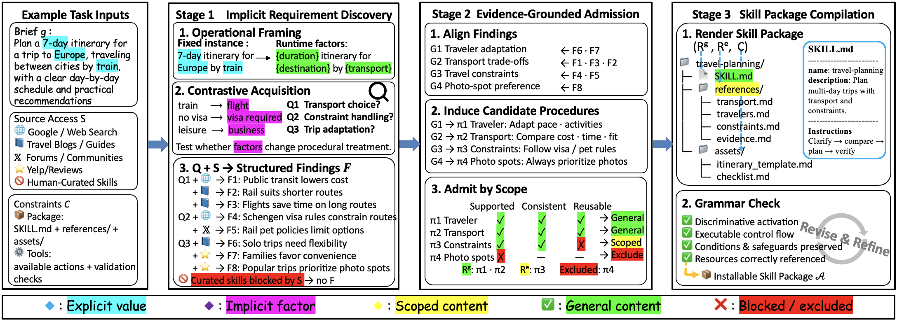
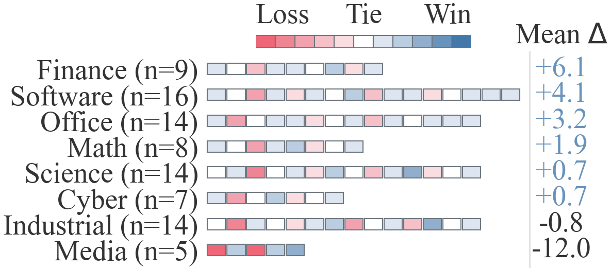

<div align="center">

# SkillAlchemy

Turn people, methods, and experience into installable, reusable agent skills.

[English](README.md) · [中文](README_CN.md)

</div>

<p align="center">
  <a href="https://github.com/agentsope/SkillAlchemy/stargazers"></a>
  
  
</p>

SkillAlchemy is an open-world agent skill creation system. It discovers omitted requirements, extracts executable procedures from public sources, and produces skills that agents can install and use directly.

<div align="center">
  
</div>

## Results

We evaluate SkillAlchemy on **87 tasks from SkillsBench v1.1** across four agent–model configurations. SkillAlchemy achieves the highest overall task pass rate in **3 of 4 configurations**.

Averaged across all configurations, SkillAlchemy reaches a **55.8%** task pass rate, improving over no-skill execution by **19.9 percentage points**. It also slightly surpasses human-curated skills on average.

<table>
  <thead>
    <tr>
      <th align="left">Skill Setting</th>
      <th align="center">Claude Code<br>DeepSeek-V4-Pro</th>
      <th align="center">Claude Code<br>Opus 4.8</th>
      <th align="center">Codex<br>DeepSeek-V4-Pro</th>
      <th align="center">Codex<br>GPT-5.5</th>
      <th align="center">Avg.</th>
    </tr>
  </thead>
  <tbody>
    <tr>
      <td>No Skill</td>
      <td align="right">23.4</td>
      <td align="right">45.3</td>
      <td align="right">29.7</td>
      <td align="right">45.1</td>
      <td align="right">35.9</td>
    </tr>
    <tr>
      <td>Anthropic Skill-Creator</td>
      <td align="right">31.7</td>
      <td align="right">49.2</td>
      <td align="right">32.9</td>
      <td align="right">48.5</td>
      <td align="right">40.6</td>
    </tr>
    <tr>
      <td>OpenAI Skill-Creator</td>
      <td align="right">33.3</td>
      <td align="right">49.9</td>
      <td align="right">37.0</td>
      <td align="right">48.5</td>
      <td align="right">42.2</td>
    </tr>
    <tr>
      <td>OpenSkill</td>
      <td align="right">42.3</td>
      <td align="right">51.5</td>
      <td align="right">40.7</td>
      <td align="right">49.4</td>
      <td align="right">46.0</td>
    </tr>
    <tr>
      <td>MUSE-Autoskill</td>
      <td align="right">43.2</td>
      <td align="right">53.3</td>
      <td align="right">40.2</td>
      <td align="right">52.0</td>
      <td align="right">47.2</td>
    </tr>
    <tr>
      <td>Human-Curated Skill</td>
      <td align="right">51.3</td>
      <td align="right">59.5</td>
      <td align="right"><strong>45.7</strong></td>
      <td align="right">60.9</td>
      <td align="right">54.4</td>
    </tr>
    <tr>
      <td><strong>SkillAlchemy</strong></td>
      <td align="right"><strong>54.7</strong></td>
      <td align="right"><strong>60.9</strong></td>
      <td align="right">43.9</td>
      <td align="right"><strong>63.7</strong></td>
      <td align="right"><strong>55.8</strong></td>
    </tr>
  </tbody>
</table>


## Features

- **Distill people** — Build Persona Skills from public evidence about decisions, failures, values, and communication patterns.
- **Distill methods** — Turn books, methodologies, repositories, or interviews into executable Skills with conditions, steps, branches, and failure handling.
- **Fuse Skills** — Combine existing workflows, domain knowledge, or working styles into a new capability.
- **Stay evidence-grounded** — Separate reusable procedures, scoped cases, and unsupported content to reduce unjustified generalization.

## Quick Start

The easiest way to install SkillAlchemy is to ask Claude Code or Codex:

```text
Install SkillAlchemy from https://github.com/agentsope/SkillAlchemy and show me how to use it.
```

Or use the command line:

```bash
npx skills add agentsope/SkillAlchemy
```

Then describe the Skill you want to create:

```text
Use SkillAlchemy to create a Skill for reviewing RAG systems. Use public documentation and research papers as sources.
```

Generated packages are written to `output/` in the active project.

### Install Individual Skills

```bash
# Core components
npx skills add agentsope/SkillAlchemy/skills/Lens
npx skills add agentsope/SkillAlchemy/skills/LEAP

# Another bundled Skill
npx skills add agentsope/SkillAlchemy/skills/<skill-name>
```

[Browse all installable Skills](skills/)


<!-- <div align="center">
  
</div> -->

---

<p align="center">
  <a href="TECHNICAL.md"><strong>Documentation</strong></a> ·
  <a href="LICENSE"><strong>MIT License</strong></a>
</p>
